# YellowskiesQRcodeBundle

WORKS WITH PHP 7.2 AND SYMFONY 2 / 3 / 4  AND Twig 2.x

[](https://packagist.org/packages/yellowskies/qr-code-bundle)

YellowskiesQRcodeBundle is a Symfony2/3/4  Barcode Generator Bundle.

Features:

1. Support 3 two-dimensional (2D) and 30 one-dimensional (1D) Barcode types
2. Three output formats: HTML, PNG and SVG canvas
3. Twig integration: you can simply use a extensional function of Twig in the template to generate Barcode
4. Core of this bundle from this project [tc-lib-barcode](https://github.com/tecnickcom/tc-lib-barcode)


## Installation

Add YellowskiesQRcodeBundle by running the command:

```sh
$ php composer.phar require yellowskies/qr-code-bundle 
```

Or, add YellowskiesQRcodeBundle to your ``composer.json``, then execute ``php composer.phar update``
```json

"require": {
        "yellowskies/qr-code-bundle": "1.2.7"
    }

```

Composer will install the bundle to your project's vendor/yellowskies directory.

Then, Enable the bundle in the kernel:
```php
<?php
// app/AppKernel.php

public function registerBundles()
{
    $bundles = array(
        // ...
        new Skies\QRcodeBundle\SkiesQRcodeBundle(),
    );
}
```

## Generate options

To generate one barcode, you have 5 options can be configured.

|option|type       |required|allowed values|description          |
|:----:|:---------:|:------:|:------------:|:-------------------:|
|code  |string     |required|              |what you want encoded|
|type  |string     |required|[Supported Types](#supported-barcode-types)|type of barcode|
|format|string     |required|html, svg, png|output format|
|width |**integer**|optional|              |**width of unit**|
|height|**integer**|optional|              |**height of unit**|
|color |string for html, svg / array for png|optional|[HTML Color Names](http://www.w3schools.com/html/html_colornames.asp) / array(R, G, B)|barcode color|

> Default width and height for 2D barcode are 5, 5, for 1D are 2, 30.
> Default color for html, svg is black, for png is array(0, 0, 0)

## Usage by service
  
The bundle registers one service: ``skies_barcode.generator`` which will allows you to generate barcode:

* outpout html
```php
$options = array(
    'code'   => 'string to encode',
    'type'   => 'c128',
    'format' => 'html',
);

$barcode =
    $this->get('skies_barcode.generator')->generate($options);
    
return new Response($barcode);
```

* outpout svg
```php
$options = array(
    'code'   => 'string to encode',
    'type'   => 'qrcode',
    'format' => 'svg',
    'width'  => 10,
    'height' => 10,
    'color'  => 'green',
);

$barcode =
    $this->get('skies_barcode.generator')->generate($options);
    
return new Response($barcode);
```

* outpout png
```php
$options = array(
    'code'   => 'string to encode',
    'type'   => 'datamatrix',
    'format' => 'png',
    'width'  => 10,
    'height' => 10,
    'color'  => array(127, 127, 127),
);

$barcode =
    $this->get('skies_barcode.generator')->generate($options);

return new Response('');
```
> For format png, the generator return the based64 of png file, so you can get the real data of png by ``base64_decode($barcode)``. Here we use [Data URI scheme](http://en.wikipedia.org/wiki/Data_URI_scheme) to direct display the png in webpage.

## Usage in Twig template

This bundle extend one function of Twig: ``barcode`` which you can simply use it to generate barcode in the twig template.

``barcode`` use the same options, only different thing is your need pass a [Twig array](http://twig.sensiolabs.org/doc/templates.html#literals) (it looks really like Json, but it isn't) in the function.

* display html
```twig
{{ barcode({code: 'string to encode', type: 'c128', format: 'html'}) }}
```

* display svg
```twig
{{ barcode({code: 'string to encode', type: 'qrcode', format: 'svg', width: 10, height: 10, color: 'green'}) }}
```

* display png
```twig

```

## Usage without service

```php
use Skies\SkiesQRcodeBundle\Generator\Generator;
//...
$options = array(
    'code'   => 'string to encode',
    'type'   => 'qrcode',
    'format' => 'html',
);

$generator = new Generator();
$barcode = $generator->generate($options);

return new Response($barcode);
```

## Save Barcode in file

As you can see, the Bundle save nothing on the file system, But if you want to keep the barcode, No problem!

* save as html
```php
$savePath = '/tmp/';
$fileName = 'sample.html';

file_put_contents($savePath.$fileName, $barcode);
```

* save as svg
```php
$savePath = '/tmp/';
$fileName = 'sample.svg';

file_put_contents($savePath.$fileName, $barcode);
```

* save as png
```php
$savePath = '/tmp/';
$fileName = 'sample.png';

file_put_contents($savePath.$fileName, base64_decode($barcode));
```

## Supported Barcode Types

Please read [Wikipedia page](http://en.wikipedia.org/wiki/Barcode) to know which type you should choice. 

### 2d barcodes

|type      |Name                                                   |Example(encode 123456)|
|:--------:|:-----------------------------------------------------:|:--------------------:|
|qrcode    |[QR code](http://en.wikipedia.org/wiki/QR_code)        ||
|pdf417    |[PDF417](http://en.wikipedia.org/wiki/PDF417)          |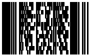|
|datamatrix|[Data Matrix](http://en.wikipedia.org/wiki/Data_Matrix)|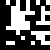|

### 1d barcodes

|type    |Symbology                                              |Example(encode 123456)|
|:------:|:-----------------------------------------------------:|:--------------------:|
|c39     |[Code 39](http://en.wikipedia.org/wiki/Code_39)        ||
|c39+    |Code 39 CHECK_DIGIT                                    |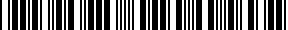|
|c39e    |Code 39 EXTENDED                                       |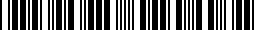|
|c39e+   |Code 39 EXTENDED CHECK_DIGIT                           ||
|c93     |[Code 93](http://en.wikipedia.org/wiki/Code_93)        |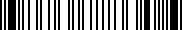|
|s25     |[Standard 2 of 5](http://www.barcodeisland.com/2of5.phtml)           |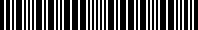|
|s25+    |Standard 2 of 5 CHECK_DIGIT                                          |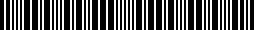|
|i25     |[Interleaved 2 of 5](http://en.wikipedia.org/wiki/Interleaved_2_of_5)|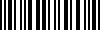|
|i25+    |Interleaved 2 of 5 CHECK_DIGIT                                       ||
|c128    |[Code 128](http://en.wikipedia.org/wiki/Code_128)                    |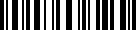|
|c128a   |Code 128A|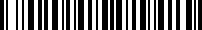|
|c128b   |Code 128B||
|c128c   |Code 128C||
|ean2    |[EAN 2](http://en.wikipedia.org/wiki/EAN_2)                 ||
|ean5    |[EAN 5](http://en.wikipedia.org/wiki/EAN_5)                 ||
|ean8    |[EAN 8](http://en.wikipedia.org/wiki/EAN-8)                 |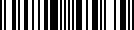|
|ean13   |[EAN 13](http://en.wikipedia.org/wiki/EAN-13)               |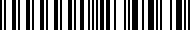|
|upca    |[UPC-A](http://en.wikipedia.org/wiki/Universal_Product_Code)||
|upce    |[UPC-B](http://en.wikipedia.org/wiki/Universal_Product_Code)|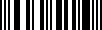|
|msi     |[MSI](http://en.wikipedia.org/wiki/MSI_Barcode)             |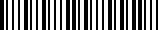|
|msi+    |MSI CHECK_DIGIT                                             |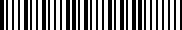|
|postnet |[POSTNET](http://en.wikipedia.org/wiki/POSTNET)             ||
|planet  |[PLANET](http://en.wikipedia.org/wiki/Postal_Alpha_Numeric_Encoding_Technique)|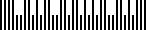|
|rms4cc|[RMS4CC](http://en.wikipedia.org/wiki/RM4SCC)    ||
|kix     |[KIX-code](http://nl.wikipedia.org/wiki/KIX-code)||
|imb     |[IM barcode](http://en.wikipedia.org/wiki/Intelligent_Mail_barcode)||
|codabar |[Codabar](http://en.wikipedia.org/wiki/Codabar)                    |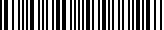|
|code11  |[Code 11](http://en.wikipedia.org/wiki/Code_11)                    |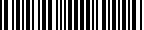|
|pharma  |[Pharmacode](http://en.wikipedia.org/wiki/Pharmacode)              |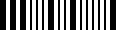|
|pharma2t|Pharmacode Two-Track                                               |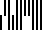|

## Requirements

If there is some problem of requirements, make sure you have install these two extensions of PHP (check in your phpinfo()).

- Barcodes requires [GD](http://php.net/manual/en/book.image.php) and [ImageMagick](http://php.net/manual/en/book.imagick.php) to create PNGs in PHP 5.3.
- Barcodes requires [PHP bcmath](http://php.net/manual/en/book.bc.php) extension for Intelligent Mail barcodes

## Tests

To execute unit tests:
```sh
$ phpunit --coverage-text
```
